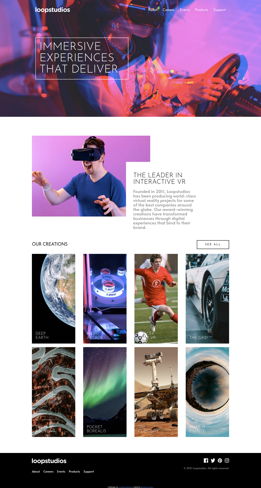
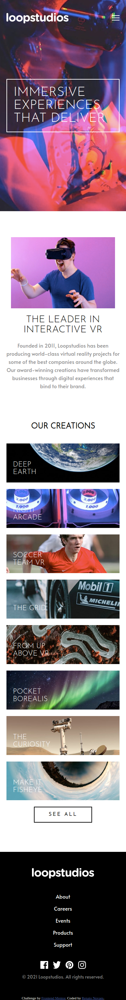

# Frontend Mentor - Loopstudios landing page solution

This is a solution to the [Loopstudios landing page challenge on Frontend Mentor](https://www.frontendmentor.io/challenges/loopstudios-landing-page-N88J5Onjw). Frontend Mentor challenges help you improve your coding skills by building realistic projects. 

## Table of contents

- [Overview](#overview)
  - [The challenge](#the-challenge)
  - [Screenshot](#screenshot)
  - [Links](#links)
- [My process](#my-process)
  - [Built with](#built-with)
  - [What I learned](#what-i-learned)
  - [Continued development](#continued-development)
- [Author](#author)

## Overview

### The challenge

Users should be able to:

- View the optimal layout for the site depending on their device's screen size
- See hover states for all interactive elements on the page

### Screenshot




### Links

- Solution URL: [Netlify](https://gracious-archimedes-0fc925.netlify.app/)

## My process

### Built with

- Semantic HTML5 markup
- CSS custom properties
- Flexbox
- Mobile-first workflow

### What I learned

It was really nice to split up the CSS Rules from the ```style.css``` into little pieces of files, where each one has rules from a section of the page. This makes the files more organized and simplify the media queries.
### Continued development

There is a little correction it has to be done in the menu mobile. The close button it's not well placed.

Also the hover effects in the cards makes the reading a little difficult.

## Author

- Website - [Renato Novaes](https://www.renatonovaes.dev)
- Linkedin - [Renato Novaes](https://www.linkedin.com/in/renatonovaes49/)
